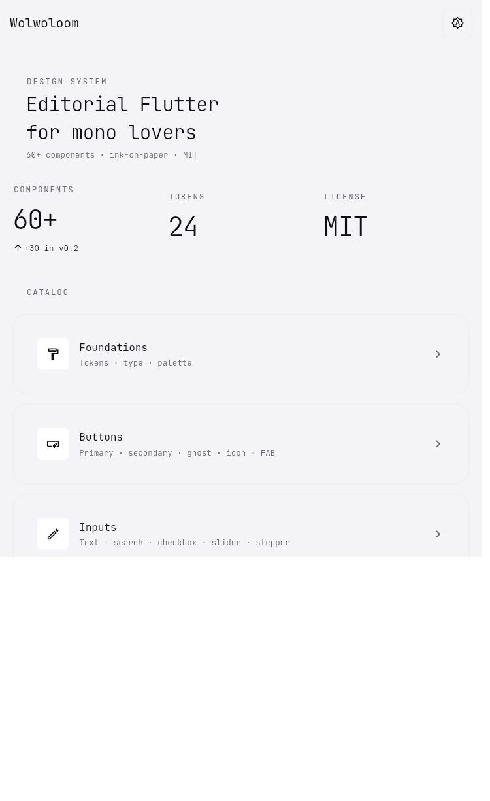
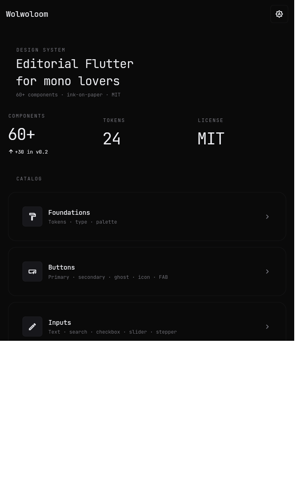
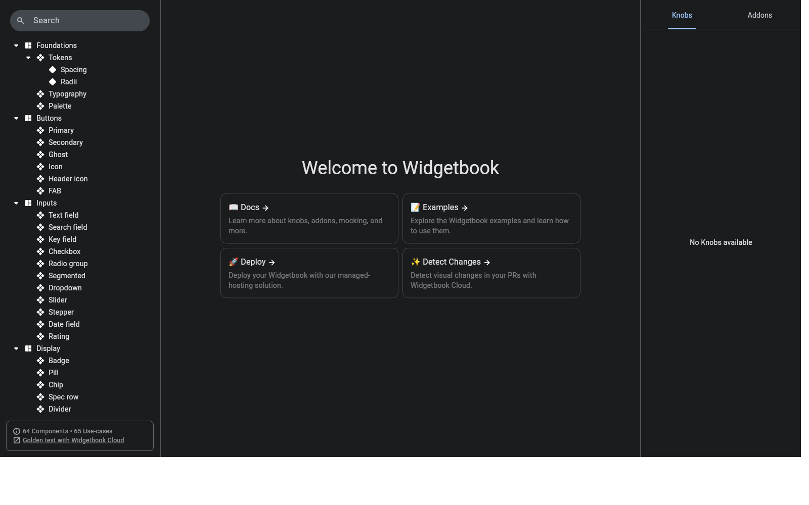

# Wolwoloom

> An editorial / typewriter-flavored Flutter design system. Mono typography, hairline borders, ink-on-paper palette with a periwinkle accent. Extracted from the [`wolwo`](https://github.com/iyashwantsaini/wolwo) wallpaper app.

[](https://github.com/iyashwantsaini/WolwoLoom/actions/workflows/ci.yml)
[](https://github.com/iyashwantsaini/WolwoLoom/actions/workflows/pages.yml)
[](https://github.com/iyashwantsaini/WolwoLoom/actions/workflows/release.yml)
[](https://flutter.dev)
[](LICENSE)

**Showcase** —

* Live web gallery → **<https://iyashwantsaini.github.io/WolwoLoom/>** (auto-deploys on every push to `main`).
* Android APKs (catalog app + widgetbook) → **[Releases](https://github.com/iyashwantsaini/WolwoLoom/releases/latest)** (built on every `v*` tag).

```dart
import 'package:wolwoloom/wolwoloom.dart';

MaterialApp(
  theme: WlmTheme.light(),
  darkTheme: WlmTheme.dark(),
  home: const MyPage(),
);
```

## Install

```yaml
dependencies:
  wolwoloom: ^0.1.0
```

```sh
flutter pub add wolwoloom
```

## Showcase

Two apps live in this repo and are both built by CI on every push to `main`:

| Showcase | What it is | Where to find it |
| --- | --- | --- |
| **Catalog app** ([`packages/wolwoloom/example`](packages/wolwoloom/example)) | A Flutter app that opens straight into a categorised catalog of every component, with a theme toggle in the app bar. Built for Android / iOS / desktop / web. | APK on the latest [release](https://github.com/iyashwantsaini/WolwoLoom/releases/latest) — `wolwoloom-example-*.apk` |
| **Widgetbook gallery** ([`apps/widgetbook`](apps/widgetbook)) | Interactive component gallery with knobs, light/dark themes, and viewport switching. Same source ships as web *and* APK. | Web: <https://iyashwantsaini.github.io/WolwoLoom/> · APK: `wolwoloom-widgetbook-*.apk` on the latest release |

### Screenshots

> Add real screenshots to `docs/screenshots/` (PNG, ~390×844). The README references the filenames below — drop replacements in and they'll show up automatically.

| Catalog (light) | Catalog (dark) | Widgetbook (web) |
| --- | --- | --- |
|  |  |  |

## Components

| Group        | Widgets                                                                                                                                                                                                |
| ------------ | ------------------------------------------------------------------------------------------------------------------------------------------------------------------------------------------------------ |
| Foundations  | `WlmTokens`, `WlmColors`, `WlmType`, `WlmMotion`, `WlmTheme`, `WlmThemeExtension`, `WlmBreakpoint`, `WlmResponsive`                                                                                    |
| Buttons      | `WlmPrimaryButton`, `WlmSecondaryButton`, `WlmGhostButton`, `WlmIconButton`, `WlmHeaderIconButton`, `WlmFab`                                                                                           |
| Inputs       | `WlmTextField`, `WlmSearchField`, `WlmKeyField`, `WlmCheckbox`, `WlmRadio`, `WlmSegmentedControl`, `WlmDropdown`, `WlmSlider`, `WlmStepper`, `WlmDateField`, `WlmRating`                               |
| Display      | `WlmBadge`, `WlmChip`, `WlmPill`, `WlmSpecRow`, `WlmDivider`, `WlmAvatar`, `WlmAvatarStack`, `WlmTag`, `WlmKbd`, `WlmStat`, `WlmCallout`, `WlmCodeBlock`, `WlmProgressBar`, `WlmProgressRing`, `WlmTooltip` |
| Layout       | `WlmCard`, `WlmPageHeader`, `WlmSectionLabel`, `WlmAppBar`, `WlmAppScaffold`, `WlmAccordion`, `WlmBreadcrumbs`, `WlmDrawer`                                                                            |
| Lists        | `WlmListTile`, `WlmActionRow`, `WlmSwitchTile`, `WlmCheckboxTile`, `WlmRadioTile`                                                                                                                      |
| Feedback     | `WlmLoader`, `WlmScanBar`, `WlmSkeleton`, `WlmGridSkeleton`, `WlmSnack`, `WlmToast`, `WlmBanner`, `WlmEmptyState`, `WlmErrorState`                                                                     |
| Navigation   | `WlmBottomNav`, `WlmStepDots`, `WlmTabBar`, `WlmShell`                                                                                                                                                 |
| Overlays     | `showWlmBottomSheet`, `WlmDialog`                                                                                                                                                                      |
| Media        | `WlmNetworkImage`, `WlmProgressiveImage`, `WlmMasonryGrid`                                                                                                                                             |

`Switch`, `Checkbox`, `Radio`, `AppBar`, `SnackBar`, `BottomNavigationBar`, `Card` and `TextSelection` are restyled automatically by `WlmTheme` — use the stock Material widgets and they'll match.

## Design language

* **Typography** — JetBrains Mono everywhere, light weights (200–400), tight negative letter-spacing on headings, wide positive on labels.
* **Spacing scale** — `4 / 8 / 12 / 16 / 24 / 32` (xs..xxl).
* **Radii** — `6 / 12 / 16 / 20`.
* **Borders** — 1px hairlines on `outlineVariant @ 0.30`. No shadows, no glassmorphism.
* **Palette** —
  * Dark: ink `#0A0A0A` · surface `#111114` · accent periwinkle `#8FA8FF`.
  * Light: paper `#F4F4F6` · ink `#0E0E14` · accent periwinkle `#4A5BD0`.
* **Motion** — short and quiet (`fast 120ms`, `medium 220ms`, `slow 320ms`).

## Repository layout

```
WolwoLoom/
├── packages/wolwoloom/         # the publishable Flutter package
│   ├── lib/                    # source
│   ├── example/                # example app (Android / iOS / Web)
│   ├── pubspec.yaml
│   └── README.md
├── apps/widgetbook/            # interactive component gallery (web + mobile)
├── reference/wolwo/            # the cloned wolwo app this system was distilled from
├── README.md (this file)
└── LICENSE
```

## Run locally

```sh
# Catalog app — runs the design system on Android / iOS / desktop / web
cd packages/wolwoloom/example
flutter run                      # Android / iOS / desktop
flutter run -d chrome            # Web

# Widgetbook — interactive component gallery (the showcase site)
cd apps/widgetbook
flutter run -d chrome            # browse every component with knobs
flutter build web                # ship the gallery as a static site
```

## CI / publishing

Three GitHub Actions workflows live under [`.github/workflows/`](.github/workflows):

| Workflow | Trigger | What it does |
| --- | --- | --- |
| [`ci.yml`](.github/workflows/ci.yml) | Push & PR to `main` | `flutter analyze` across the package, example and widgetbook · `flutter test` for the package. |
| [`pages.yml`](.github/workflows/pages.yml) | Push to `main` (paths: `apps/widgetbook/**`, `packages/wolwoloom/**`) · `workflow_dispatch` | Builds the widgetbook for web and deploys it to GitHub Pages. **One-time setup:** *Repo → Settings → Pages → Source: GitHub Actions.* |
| [`release.yml`](.github/workflows/release.yml) | Push of any `v*` tag · `workflow_dispatch` | Builds release APKs for both showcase apps (split-per-ABI + universal) and publishes them to a GitHub Release. Optionally signs with a keystore from repo secrets — see the comments at the top of the file. |

To cut a release:

```sh
git tag v0.2.0
git push origin v0.2.0
```

## Roadmap

* `WlmAutocomplete`, `WlmRangeSlider`, `WlmTimeField`
* Form orchestration (`WlmForm`, validators, error summary)
* `WlmDataTable`, sortable mono table for dense data
* Charts (mono sparkline, bar, ring)
* `go_router` glue for `WlmShell`
* Built-in onboarding / settings page templates
* Generated docs site (Dartdoc + the widgetbook web build)

## Reference

The [`reference/wolwo/`](reference/wolwo) folder is a shallow clone of the wolwo wallpaper app that this design system was distilled from. Treat it as living documentation: every component in `wolwoloom` has a counterpart there showing how it was originally consumed.

## License

[MIT](LICENSE) — do whatever you want, just keep the notice. The cloned `reference/wolwo/` retains its own license.
