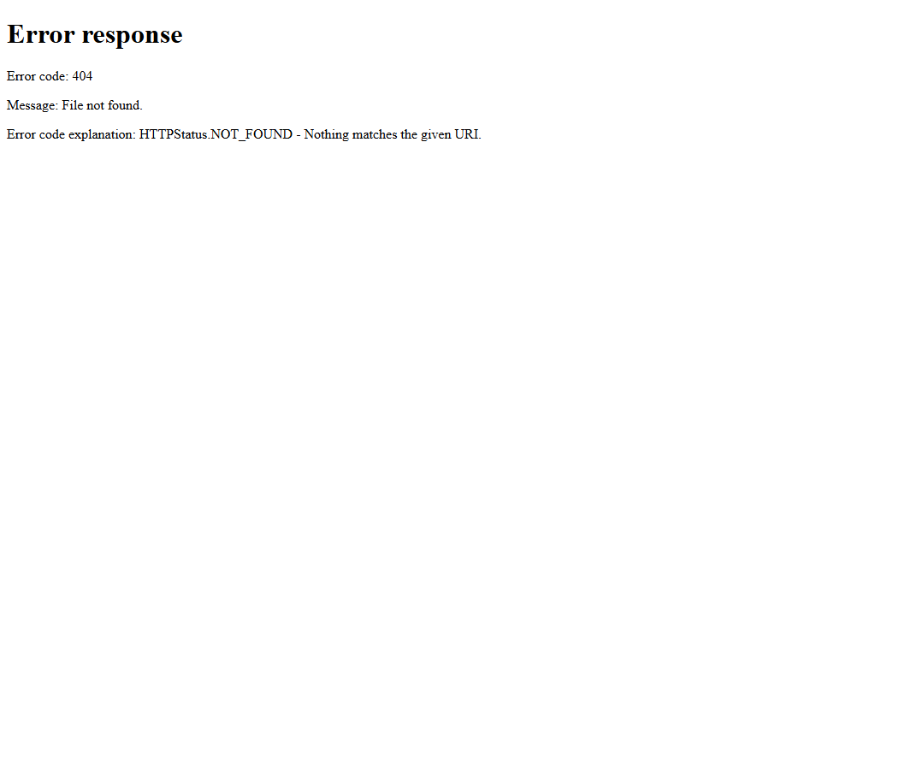
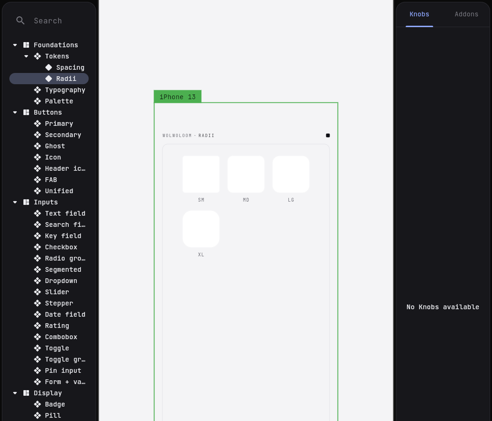
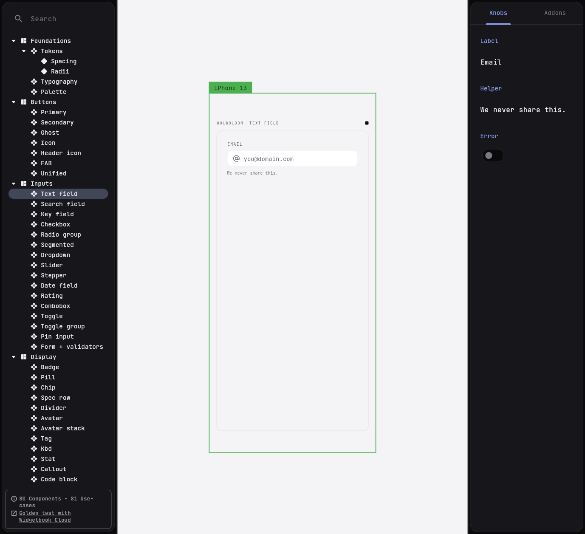
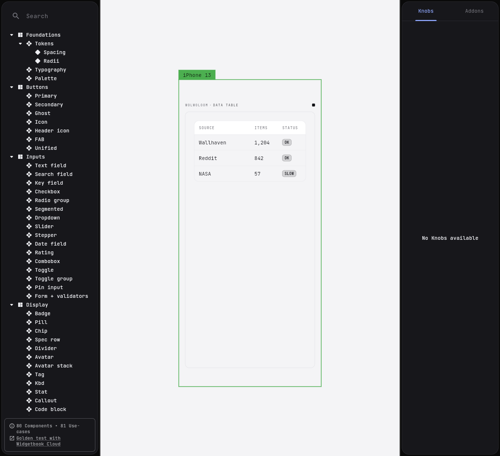
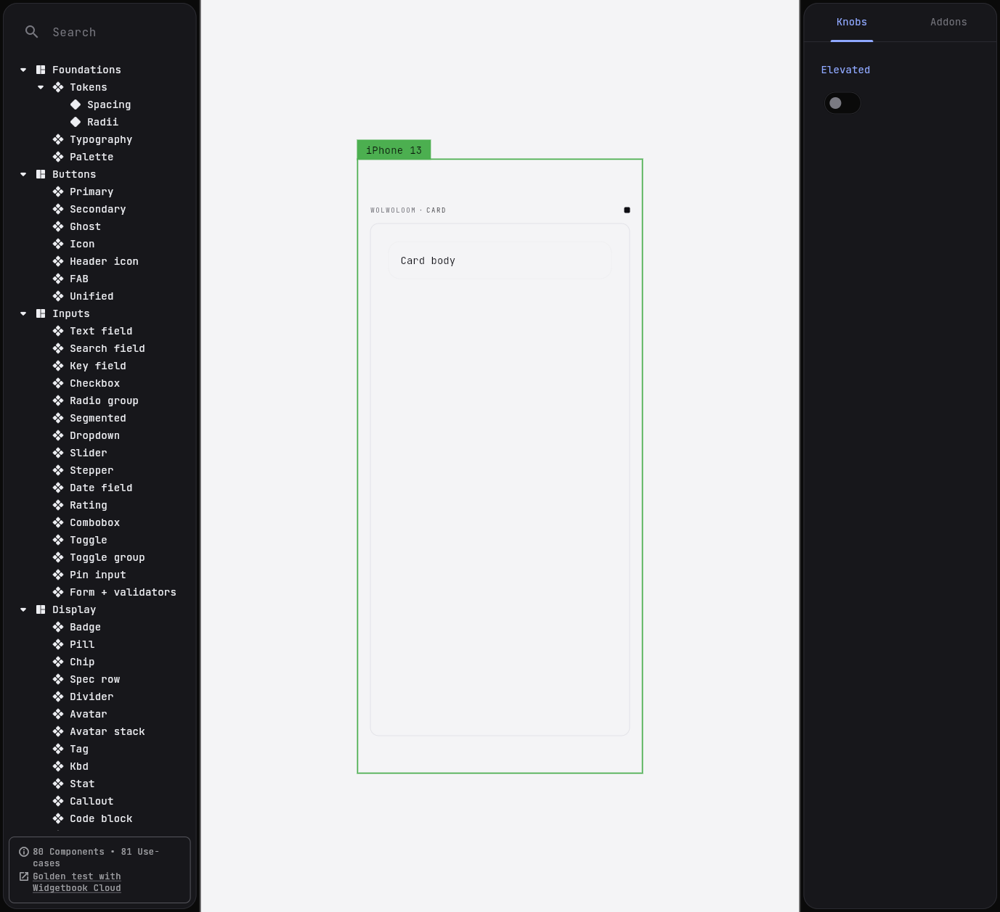
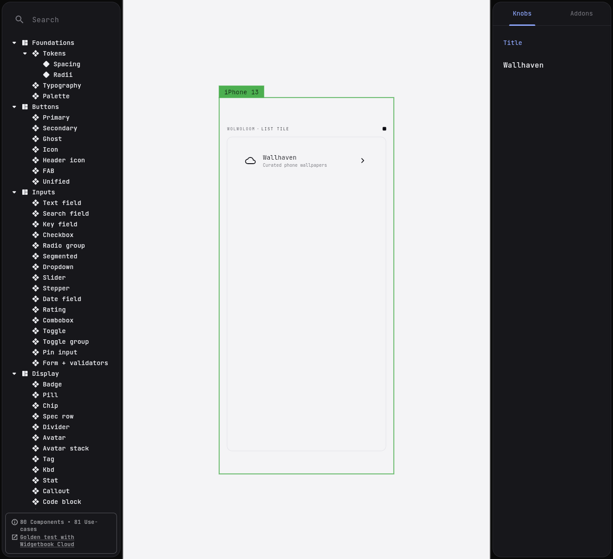
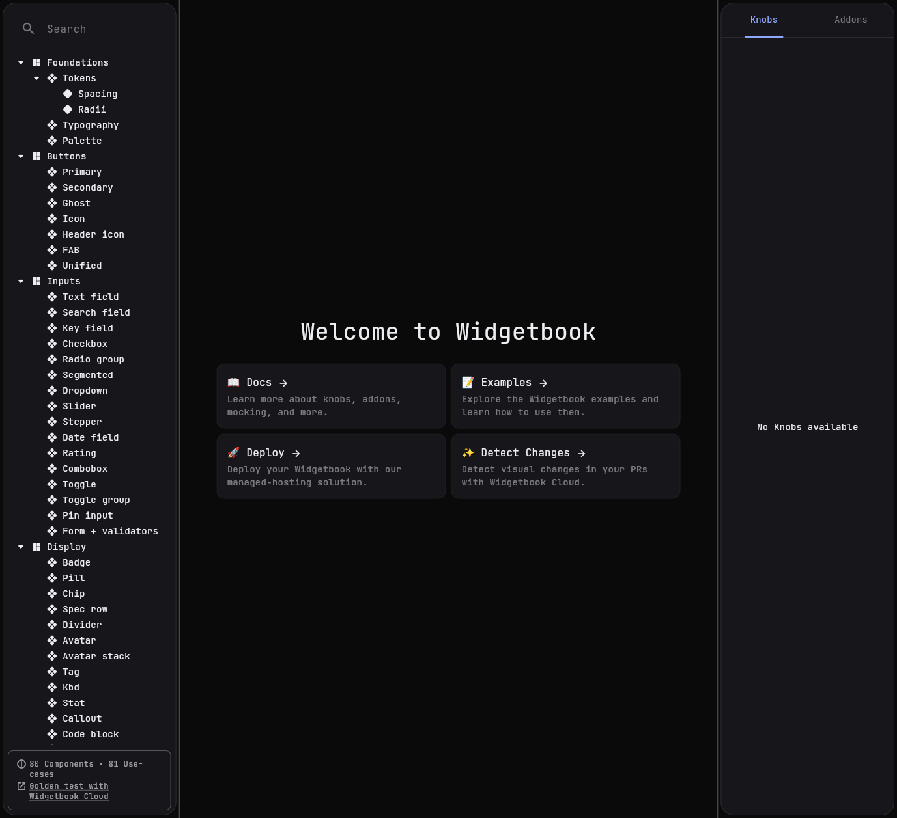
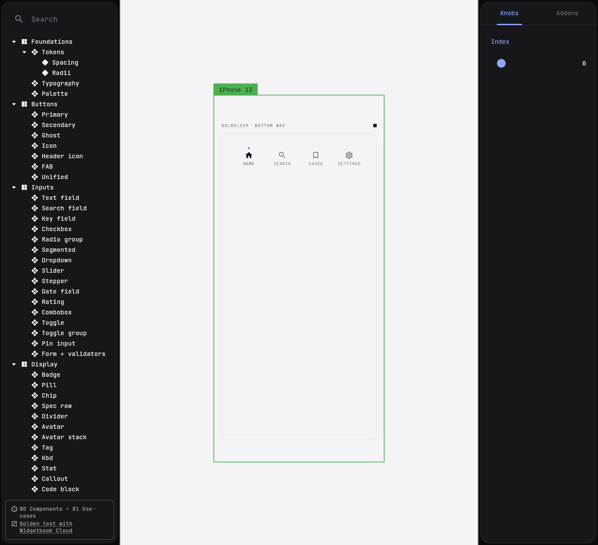

# wloom · screenshot gallery

Visual reference for the **wloom** showcase app, demo templates, and the **wloom wb** widgetbook gallery. Captured against the live builds — every shot is reproducible from `main` using [`SKILL.md`](screenshots/SKILL.md).

* Live web gallery (wloom wb) → <https://iyashwantsaini.github.io/wloom/>
* `wloom` APK + `wloom wb` APK → [latest release](https://github.com/iyashwantsaini/wloom/releases/latest)
* Source for screens → [packages/wolwoloom/example/lib/screens](../packages/wolwoloom/example/lib/screens)

---

## wloom — home & component categories

| | |
| :---: | :---: |
|  wloom · dark |  wloom · light |
|  Foundations |  Buttons |
|  Inputs |  Forms |
|  Display |  Layout |
|  Lists |  Feedback |
|  Navigation |  Overlays |
|  Media | |

## Demo screens — drop-in templates built from the kit

| | | |
| :---: | :---: | :---: |
|  Login |  Onboarding |  Dashboard |
|  Profile |  Settings |  Chat |

Each screen is built **only** from public `Wlm*` widgets (`WlmAppScaffold`, `WlmTextField`, `WlmKpiCard`, `WlmTimeline`, `WlmMessageBubble`, `WlmActionSheet`, `WlmSurface`, …). Drop them into your app verbatim or pull pieces.

## wloom wb — interactive gallery with knobs, themes, and viewport switching

| | |
| :---: | :---: |
|  Typography |  Palette |
|  Spacing tokens |  Radii tokens |
|  Buttons |  Inputs |
|  KPI card |  Timeline |
|  Message bubble |  Data table |
|  Surface |  Card |
|  Lists |  Feedback |
|  Navigation |  Action sheet |

---

### How these were captured

Full agent-runnable recipe: [`screenshots/SKILL.md`](screenshots/SKILL.md).

* **wloom** — `flutter build web --release` then served via `python -m http.server 8765`. Each route is reachable as `?screen=<demo>` or `?page=<category>`.
* **wloom wb** — `flutter build web --release --base-href /wloom/`, served on `:8766`. Stories addressed via `#/?path=<category>/<component>/<usecase>`.
* All shots taken at the live browser viewport (no fake mobile frames, no upscaling).
